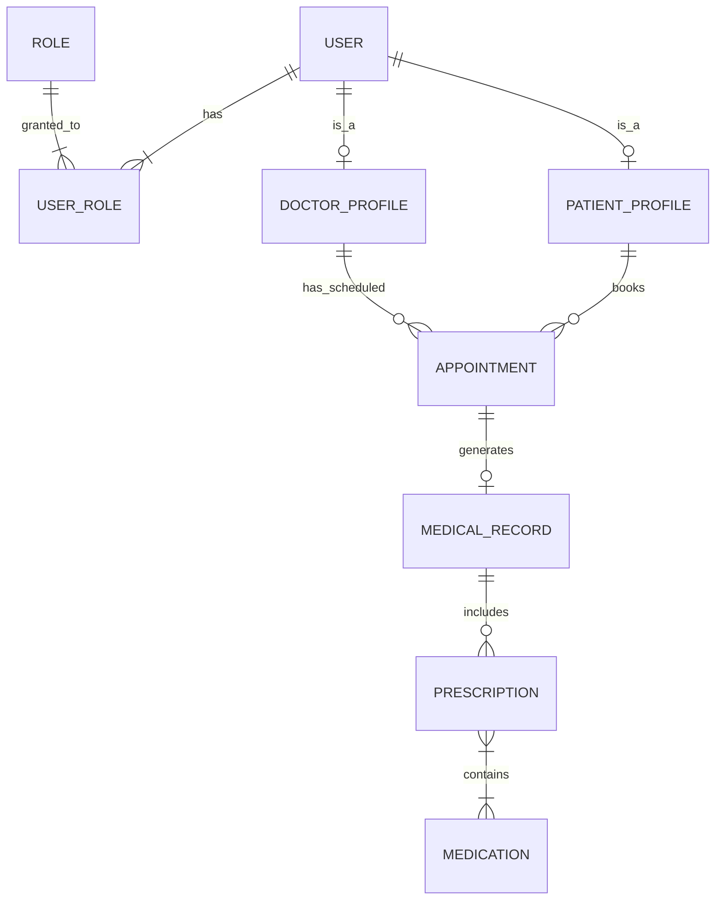

# Sistem de gestiune pentru o clinică medicală (MediCare)

## Descrierea proiectului
Aplicația este un sistem complet pentru managementul activității dintr-o clinică medicală, gândit pentru a fi scalabil printr-o arhitectură bazată pe microservicii. Sistemul permite gestionarea utilizatorilor (personal și pacienți), a programărilor medicale, dar și a istoricului medical (fișe de consultație și rețete). 

Trecerea de la un monolit la arhitectura distribuită se va face prin spargerea aplicației în 3 microservicii independente: *Identity Service*, *Appointment Service* și *Medical Records Service*.

## Cerințe funcționale preliminare
1. **Gestiunea utilizatorilor (CRUD):** Crearea, citirea, actualizarea și ștergerea profilurilor pentru medici și pacienți.
2. **Securitate și autorizare:** Autentificare securizată și protejarea endpoint-urilor pe baza a minimum două roluri (ADMIN, DOCTOR, PATIENT).
3. **Gestiunea programărilor:** Pacienții pot vizualiza medicii disponibili și pot rezerva sau anula programări.
4. **Istoric Mmdical și rețete:** Medicii pot crea fișe medicale asociate unei programări finalizate și pot emite rețete conținând mai multe medicamente.
5. **Paginare și sortare:** Navigarea prin listele lungi (ex: lista de programări, lista de pacienți) va fi paginată și sortabilă după minim 2 criterii.

## Modelul de date (ERD)
Modelul nostru de date conține 8 entități interconectate:
* **@OneToOne:** `User` - `DoctorProfile`, `Appointment` - `MedicalRecord`.
* **@OneToMany / @ManyToOne:** `PatientProfile` - `Appointment`, `DoctorProfile` - `Appointment`, `MedicalRecord` - `Prescription`.
* **@ManyToMany:** `User` - `Role`, `Prescription` - `Medication`.



## Arhitectură (microservicii)

| Modul | Port | Rol |
|---|---|---|
| `common-lib` | — | DTO-uri, `JwtUtil`, interfețe Feign, model erori, excepții (partajat) |
| `discovery-server` | 8761 | Eureka — service registry |
| `api-gateway` | 8080 | Spring Cloud Gateway — routing, rate limiting, filtru JWT |
| `web-ui` | 8090 | Frontend Thymeleaf + Bootstrap |
| `identity-service` | 8081 | Utilizatori, roluri, profiluri, autentificare, emitere JWT |
| `appointment-service` | 8082 | Programări (rezervare/anulare/finalizare) |
| `medical-records-service` | 8083 | Fișe medicale, rețete, medicamente |

Fiecare microserviciu are propria schemă de bază de date; referințele între servicii se fac prin ID (fără join-uri JPA între servicii). JWT-ul este validat local în fiecare serviciu folosind `common-lib`.

## Cerințe de build (IMPORTANT)

- **Java 21 (LTS)** — proiectul **trebuie** compilat cu JDK 21. Versiuni mai noi (ex. 25) nu sunt compatibile cu procesorul de adnotări Lombok folosit aici.
- **Maven 3.9+**
- (Opțional, pentru rulare completă) Docker + Docker Compose, PostgreSQL, Redis.

Dacă `java`/Maven implicit nu este 21, setează `JAVA_HOME` către JDK 21 înainte de build:

```bash
export JAVA_HOME="$(/usr/libexec/java_home -v 21)"   # macOS
mvn clean install
```
