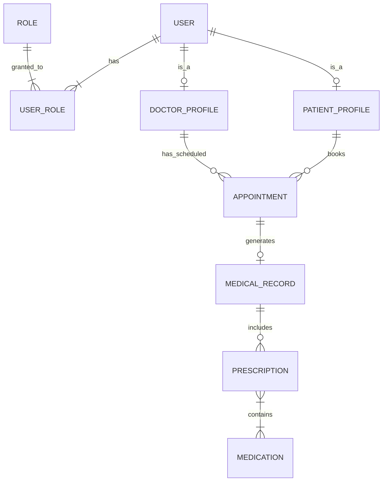

# Sistem de gestiune pentru o clinică medicală (MediCare)

## Descrierea proiectului
Aplicația este un sistem complet pentru managementul activității dintr-o clinică medicală, gândit pentru a fi scalabil printr-o arhitectură bazată pe microservicii. Sistemul permite gestionarea utilizatorilor (personal și pacienți), a programărilor medicale, dar și a istoricului medical (fișe de consultație și rețete). 

Trecerea de la un monolit la arhitectura distribuită se va face prin spargerea aplicației în 3 microservicii independente: *Identity Service*, *Appointment Service* și *Medical Records Service*.

## Cerințe funcționale preliminare
1. **Gestiunea utilizatorilor (CRUD):** Crearea, citirea, actualizarea și ștergerea profilurilor pentru medici și pacienți.
2. **Securitate și autorizare:** Autentificare securizată și protejarea endpoint-urilor pe baza a minimum două roluri (ADMIN, DOCTOR, PATIENT).
3. **Gestiunea programărilor:** Pacienții pot vizualiza medicii disponibili și pot rezerva sau anula programări.
4. **Istoric Medical și rețete:** Medicii pot crea fișe medicale asociate unei programări finalizate și pot emite rețete conținând mai multe medicamente.
5. **Paginare și sortare:** Navigarea prin listele lungi (ex: lista de programări, lista de pacienți) va fi paginată și sortabilă după minim 2 criterii.

## Modelul de date (ERD)
Modelul nostru de date conține 8 entități interconectate:
* **@OneToOne:** `User` - `DoctorProfile`, `Appointment` - `MedicalRecord`.
* **@OneToMany / @ManyToOne:** `PatientProfile` - `Appointment`, `DoctorProfile` - `Appointment`, `MedicalRecord` - `Prescription`.
* **@ManyToMany:** `User` - `Role`, `Prescription` - `Medication`.



## Arhitectură (microservicii)

| Modul | Port | Rol |
|---|---|---|
| `common-lib` | — | DTO-uri, `JwtUtil`, interfețe Feign, model erori, excepții (partajat) |
| `discovery-server` | 8761 | Eureka — service registry |
| `api-gateway` | 8080 | Spring Cloud Gateway — routing, rate limiting, filtru JWT **(implementat)** |
| `web-ui` | 8090 | Frontend Thymeleaf + Bootstrap |
| `identity-service` | 8081 | Utilizatori, roluri, profiluri, autentificare, emitere JWT **(implementat)** |
| `appointment-service` | 8082 | Programări (rezervare/anulare/finalizare) |
| `medical-records-service` | 8083 | Fișe medicale, rețete, medicamente |

Fiecare microserviciu are propria schemă de bază de date; referințele între servicii se fac prin ID (fără join-uri JPA între servicii). **identity-service** emite JWT-uri la login; celelalte servicii le pot valida local via `common-lib` (`JwtUtil`).

## Identity service (autentificare + utilizatori)

Serviciul de identitate gestionează utilizatori, roluri (ADMIN/DOCTOR/PATIENT), profiluri doctor/pacient și emiterea JWT.

**Pornire (necesită PostgreSQL `medicare_identity`):**

Dacă Postgres rulează deja din Docker Compose (volum vechi), creează manual baza (atenție: `-d medicare_appointment`, nu doar `-U medicare`):

```bash
docker exec medicare-awbd-postgres-1 psql -U medicare -d medicare_appointment -c "CREATE DATABASE medicare_identity;"
```

La un volum Postgres nou, `docker/postgres-init.sql` o creează automat.

**Pornire locală (Java 21):** nu folosi `-am` cu `spring-boot:run` (pornește greșit parent-ul). Instalează `common-lib`, apoi rulează modulul:

```bash
export JAVA_HOME="$(/usr/libexec/java_home -v 21)"
mvn -pl common-lib install -DskipTests
mvn -pl identity-service spring-boot:run
```

**Pornire cu Docker Maven (Mac — Postgres din compose pe host):**

```bash
docker run --rm -p 8081:8081 \
  -v "$(pwd)":/workspace -w /workspace \
  -e DB_HOST=host.docker.internal \
  -e DB_NAME=medicare_identity \
  -e DB_USER=medicare -e DB_PASSWORD=medicare \
  maven:3.9-eclipse-temurin-21 bash -c \
  "mvn -pl identity-service -am package -DskipTests && java -jar identity-service/target/identity-service-1.0.0.jar"
```

> Nu folosi `-am spring-boot:run` (pornește greșit parent-ul). `package` + `java -jar` e varianta sigură.

Aștepți ~1–2 minute la primul start (build + descărcare dependențe). Când vezi `Started IdentityServiceApplication`, testezi login-ul.

**Utilizatori demo (seed la pornire):** `admin/admin`, `doctor/doctor`, `patient/patient`.

**Test login (JWT):**

```bash
curl -s -X POST http://localhost:8081/auth/login \
  -H "Content-Type: application/json" \
  -d '{"username":"doctor","password":"doctor"}'
```

**Contract Feign (`/internal`)** — folosit de appointment-service pentru validare doctor/pacient:

| Metodă | Endpoint | Răspuns |
|---|---|---|
| GET | `/internal/doctors/{id}` | `DoctorDto` |
| GET | `/internal/patients/{id}` | `PatientDto` |
| GET | `/internal/users/{id}` | `UserDto` |

> web-ui se autentifică prin `POST /auth/login` pe identity-service (Faza 4).

## API Gateway (port 8080)

Punct unic de intrare: validează JWT, rate limiting Redis, rutează către microservicii.

| Prefix gateway | Serviciu | Exemplu |
|---|---|---|
| `/identity/**` | identity-service :8081 | `POST /identity/auth/login` → `/auth/login` |
| `/appointments/**` | appointment-service :8082 | `GET /appointments/api/appointments` |
| `/records/**` | medical-records-service :8083 | `GET /records/api/records` |
| `/**` | web-ui :8090 | proxy UI (opțional) |

**Pornire** (Redis din `docker compose` trebuie să ruleze; identity + appointment min.):

```bash
docker run --rm -p 8080:8080 \
  -v "$(pwd)":/workspace -w /workspace \
  -e REDIS_HOST=host.docker.internal \
  -e IDENTITY_URI=http://host.docker.internal:8081 \
  -e APPOINTMENT_URI=http://host.docker.internal:8082 \
  -e RECORDS_URI=http://host.docker.internal:8083 \
  -e WEB_UI_URI=http://host.docker.internal:8090 \
  maven:3.9-eclipse-temurin-21 bash -c \
  "mvn -pl api-gateway -am package -DskipTests && java -jar api-gateway/target/api-gateway-1.0.0.jar"
```

> **Mac / Docker:** din container, `localhost:8081` e containerul gateway, nu hostul. Folosește `host.docker.internal` ca mai sus. Alternativ, rulează gateway **local** (fără Docker): `java -jar api-gateway/target/api-gateway-1.0.0.jar` — atunci `localhost:8081` funcționează.

**Teste rapide:**

```bash
# 1. Login prin gateway (public, fără JWT)
curl -s -X POST http://localhost:8080/identity/auth/login \
  -H "Content-Type: application/json" \
  -d '{"username":"doctor","password":"doctor"}'

# 2. Salvează tokenul, apoi API protejat
TOKEN="<token>"
curl -s http://localhost:8080/appointments/api/appointments \
  -H "Authorization: Bearer $TOKEN"

# 3. Fără token → 401
curl -s -o /dev/null -w "HTTP %{http_code}\n" \
  http://localhost:8080/appointments/api/appointments
```


## Interfață utilizator (web-ui)

Frontend modern cu temă medicală, construit cu **Thymeleaf + Bootstrap 5** (port **8090**):

- **Autentificare reală** — login prin identity-service (`/auth/login`); JWT-ul sesiunii e propagat automat la apelurile backend.
- **Management utilizatori** (ADMIN) — `/users` — CRUD conturi și roluri.
- **Management doctori** (ADMIN) — `/doctors` — profiluri medicale legate de conturi.
- **Management pacienți** (ADMIN/DOCTOR listă, ADMIN creare) — `/patients`.
- **Programări** — formular cu **dropdown doctor/pacient** (nu ID-uri manuale); pacientul logat își vede profilul pre-selectat.
- **Fișe medicale**, **medicamente** — ca înainte; editare catalog doar ADMIN.

**Docker (Mac)** — variabilele cu `-e`, nu înainte de `docker run`:

```bash
docker compose stop web-ui

docker run --rm -p 8090:8090 \
  -e IDENTITY_URL=http://host.docker.internal:8081 \
  -e APPOINTMENT_URL=http://host.docker.internal:8082 \
  -e RECORDS_URL=http://host.docker.internal:8083 \
  -v "$(pwd)":/workspace -w /workspace \
  maven:3.9-eclipse-temurin-21 bash -c \
  "mvn -pl web-ui -am package -DskipTests -q && java -jar web-ui/target/web-ui-1.0.0.jar"
```

**Local (Maven pe host, fără Docker):**

```bash
IDENTITY_URL=http://localhost:8081 \
APPOINTMENT_URL=http://localhost:8082 \
RECORDS_URL=http://localhost:8083 \
mvn -pl web-ui spring-boot:run
```

**Prin gateway** (când rulează pe 8080):

```bash
IDENTITY_URL=http://localhost:8080/identity \
APPOINTMENT_URL=http://localhost:8080/appointments \
RECORDS_URL=http://localhost:8080/records \
mvn -pl web-ui spring-boot:run
```

> **identity-service trebuie să ruleze** pe 8081 (sau via gateway) — altfel login-ul eșuează.
> Utilizatori demo (seed identity): `admin/admin`, `doctor/doctor`, `patient/patient`.

## Cerințe de build (IMPORTANT)

- **Java 21 (LTS)** — proiectul **trebuie** compilat cu JDK 21. Versiuni mai noi (ex. 25) nu sunt compatibile cu procesorul de adnotări Lombok folosit aici.
- **Maven 3.9+**
- (Opțional, pentru rulare completă) Docker + Docker Compose, PostgreSQL, Redis.

Dacă `java`/Maven implicit nu este 21, setează `JAVA_HOME` către JDK 21 înainte de build:

```bash
export JAVA_HOME="$(/usr/libexec/java_home -v 21)"   # macOS
mvn clean install
```

## Eureka (discovery-server)

Registry-ul de servicii Netflix Eureka. Celelalte microservicii se înregistrează aici când `EUREKA_ENABLED=true`.

**Pornire (terminal separat):**

```bash
export JAVA_HOME="$(/usr/libexec/java_home -v 21)"   # macOS — obligatoriu JDK 21
mvn -pl discovery-server spring-boot:run
```

**Verificare:** deschide **http://localhost:8761** — dashboard-ul Eureka ar trebui să se încarce (inițial fără instanțe înregistrate).

**Test rapid (fără browser):**

```bash
curl -s -o /dev/null -w "HTTP %{http_code}\n" http://localhost:8761
# așteptat: HTTP 200
```

**Înregistrare servicii (opțional, după ce Eureka rulează):** pornește un serviciu Dev B cu Eureka activ:

```bash
EUREKA_ENABLED=true EUREKA_URL=http://localhost:8761/eureka/ mvn -pl appointment-service spring-boot:run
```

Reîmprospătează dashboard-ul — ar trebui să apară `APPOINTMENT-SERVICE` cu o instanță `UP`.

## Rulare locală (dezvoltare)

Serviciile de business și UI-ul pot rula independent. Din rădăcina proiectului, în terminale separate:

```bash
# 0. (Opțional) Discovery Server (port 8761) — vezi secțiunea Eureka de mai sus
mvn -pl discovery-server spring-boot:run

# 1. Appointment Service (port 8082) — necesită PostgreSQL "medicare_appointment"
mvn -pl appointment-service spring-boot:run

# 2. Medical Records Service (port 8083) — necesită PostgreSQL "medicare_records" + Redis
mvn -pl medical-records-service spring-boot:run

# 3. Identity Service (port 8081) — necesită PostgreSQL "medicare_identity"
mvn -pl identity-service -am package -DskipTests && java -jar identity-service/target/identity-service-1.0.0.jar

# 4. Web UI (port 8090) — necesită identity-service pentru login
IDENTITY_URL=http://localhost:8081 mvn -pl web-ui spring-boot:run
```

Apoi deschide **http://localhost:8090** și autentifică-te cu unul dintre utilizatorii demo:

| Utilizator | Parolă | Rol |
|---|---|---|
| `admin` | `admin` | ADMIN (gestionează catalogul de medicamente) |
| `doctor` | `doctor` | DOCTOR |
| `patient` | `patient` | PATIENT |

> Pentru rulare rapidă a dependențelor locale: `docker run -p 5432:5432 -e POSTGRES_USER=medicare -e POSTGRES_PASSWORD=medicare -e POSTGRES_DB=medicare_appointment postgres:16` (similar pentru `medicare_records`) și `docker run -p 6379:6379 redis:7`. Variabilele `DB_HOST/DB_PORT/DB_NAME/REDIS_HOST` sunt configurabile.
> Dacă identity-service nu rulează, apelurile Feign cad pe fallback-ul Resilience4j (mod degradat), deci UI-ul rămâne funcțional.

## Rulare cu Docker Compose (recomandat)

Pornește întreaga aplicație (PostgreSQL + Redis + cele 3 servicii) cu o singură comandă — necesită doar Docker:

```bash
docker compose up --build
```

Apoi deschide **http://localhost:8090** și autentifică-te (`admin/admin`, `doctor/doctor`, `patient/patient`).
Oprire: `docker compose down` (adaugă `-v` pentru a șterge și datele).

> `docker-compose.yml` pornește serviciile de business (appointment, records), web-ui, PostgreSQL și Redis. **identity-service** și **discovery-server** sunt implementate dar se adaugă în compose în Faza 6; până atunci rulează local cu Maven (vezi secțiunile Eureka și Identity).

## Rulare demo (fără Docker, fără infrastructură — H2 în memorie)

Pentru a porni rapid fără Docker/PostgreSQL/Redis, folosește profilul `demo` (H2 în memorie, cache simplu, fără Eureka). După `mvn clean package`, în terminale separate:

```bash
java -jar appointment-service/target/appointment-service-1.0.0.jar --spring.profiles.active=demo   # :8082
java -jar medical-records-service/target/medical-records-service-1.0.0.jar --spring.profiles.active=demo  # :8083  (pornește-l după appointment-service)
java -jar web-ui/target/web-ui-1.0.0.jar   # :8090
```

> Dacă identity-service nu rulează, apelurile Feign din appointment-service cad pe fallback-ul Resilience4j (mod degradat), deci UI-ul rămâne funcțional.

## API REST

**identity-service** (`:8081`)

| Metodă | Endpoint | Descriere |
|---|---|---|
| POST | `/auth/login` | Login → JWT (username, roles, userId) |
| POST | `/auth/register` | Înregistrare pacient (ROLE_PATIENT) → JWT |
| GET/POST/PUT/DELETE | `/api/users[/{id}]` | CRUD utilizatori (ADMIN) |
| GET/POST/DELETE | `/api/doctors[/{id}]` | Listă/CRUD profiluri doctor |
| GET/POST/DELETE | `/api/patients[/{id}]` | Listă/CRUD profiluri pacient (ADMIN/DOCTOR) |
| GET | `/internal/doctors/{id}` | Contract Feign — validare doctor |
| GET | `/internal/patients/{id}` | Contract Feign — validare pacient |
| GET | `/internal/users/{id}` | Contract Feign — detalii user |

**appointment-service** (`:8082`)

| Metodă | Endpoint | Descriere |
|---|---|---|
| POST | `/api/appointments` | Rezervă o programare (validare + reguli BR-8/9/10) |
| GET | `/api/appointments/{id}` | Detalii programare |
| GET | `/api/appointments?page=&size=&sort=scheduledAt,desc` | Listă paginată + sortabilă |
| POST | `/api/appointments/{id}/cancel` | Anulează (doar din BOOKED) |
| POST | `/api/appointments/{id}/complete` | Finalizează (doar din BOOKED) |

**medical-records-service** (`:8083`)

| Metodă | Endpoint | Descriere |
|---|---|---|
| POST | `/api/records` | Creează fișă + rețete (BR-13/14/16/17) |
| GET | `/api/records/{id}` | Detalii fișă |
| GET | `/api/records?page=&size=&sort=createdAt,desc` | Listă paginată |
| POST/GET/PUT/DELETE | `/api/medications[/{id}]` | CRUD catalog medicamente (paginat) |
| GET | `/api/medications/all` | Tot catalogul (cache Redis) |

Erorile sunt returnate uniform (`ErrorResponse`: timestamp, status, message, path, fieldErrors).

## Testare

```bash
mvn verify        # rulează unit + integration tests și generează rapoarte JaCoCo
```

- Unit tests (JUnit 5 + Mockito) pe service layer: **>70%** (appointment ~97%, records ~91%).
- Integration tests end-to-end (MockMvc + H2): rezervare→listare, rezervare→finalizare, creare fișă cu rețetă (@ManyToMany), paginare medicamente.
- Rapoarte coverage: `*/target/site/jacoco/index.html`.

## Funcționalități principale

- **Model de date bogat** — 8 entități cu toate tipurile de relații JPA (`@OneToOne`, `@OneToMany`/`@ManyToOne`, `@ManyToMany`).
- **CRUD complet** cu Spring Data JPA, service layer și tratare specifică a excepțiilor (`@RestControllerAdvice` + `ErrorResponse` uniform).
- **Reguli de business** pentru programări și fișe medicale (vezi `BUSINESS_RULES.md`).
- **Comunicare între microservicii** prin OpenFeign, rezilientă cu Resilience4j (circuit breaker + retry + fallback).
- **Caching** cu Redis pentru datele citite frecvent (catalog de medicamente).
- **Frontend modern** Thymeleaf + Bootstrap 5 (homepage hero, listă programări tip timeline, fișe în acordeon, grilă de medicamente), cu validare și pagini de eroare custom.
- **Securitate** — login, 3 roluri (ADMIN/DOCTOR/PATIENT), BCrypt, remember-me, CSRF, autorizare pe rol.
- **Paginare și sortare** pe listele principale (≥2 criterii), configurabile.
- **Multi-environment** — profiluri `dev` (PostgreSQL), `test` (H2) și `demo` (H2, rulare fără infrastructură).
- **Logging** SLF4J + Logback, cu fișier separat pentru erori.
- **Service discovery** — `discovery-server` (Eureka, port 8761) pentru înregistrarea microserviciilor.
- **Autentificare JWT** — `identity-service` (login/register, CRUD users/doctors/patients, contract `/internal` pentru Feign).
- **API Gateway** — routing centralizat, validare JWT, rate limiting Redis (port 8080).
- **Containerizare** — `docker-compose` pentru servicii + PostgreSQL + Redis.
- **Testare** — teste unitare (JUnit 5 + Mockito, >70% pe service layer) și de integrare (MockMvc + H2).

## Contribuții echipă

- **andra1286** — `common-lib`, `appointment-service`, `medical-records-service`, `web-ui` (frontend), comunicare Feign + Resilience4j + caching Redis, teste de integrare, profil `demo`, `docker-compose`.
- *(membru 2 — Dev A: `discovery-server`, identity-service, api-gateway, CI/CD — de completat pe măsură ce contribuie)*
