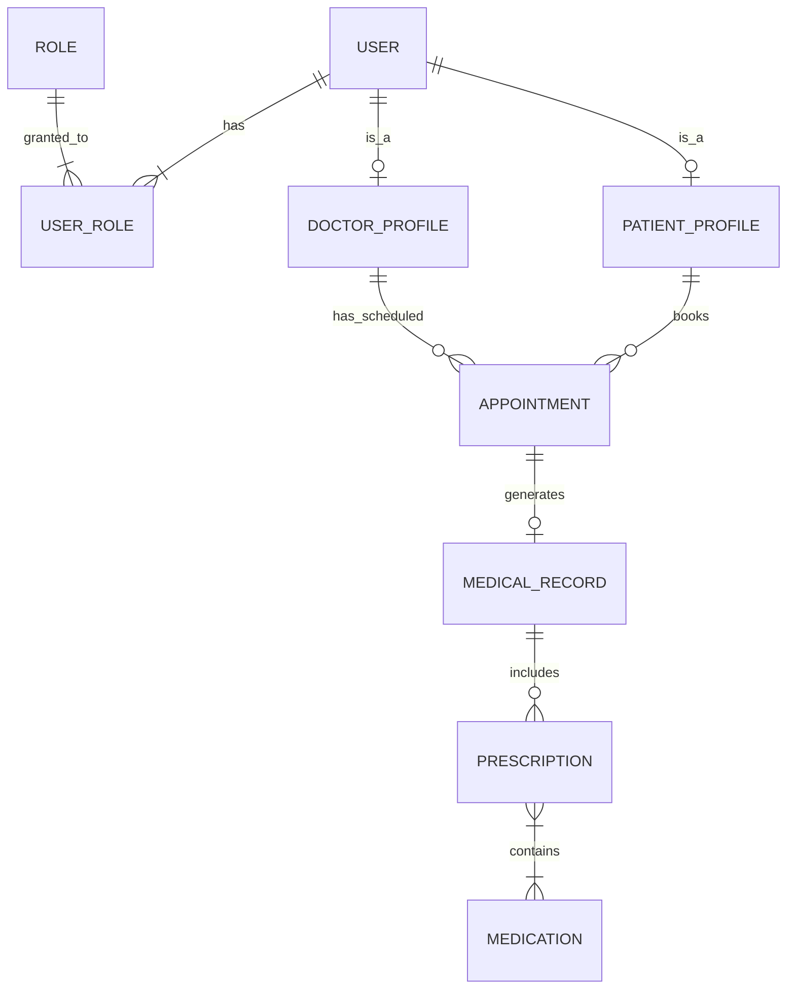

# Sistem de gestiune pentru o clinică medicală (MediCare)

## Descrierea proiectului
Aplicația este un sistem complet pentru managementul activității dintr-o clinică medicală, gândit pentru a fi scalabil printr-o arhitectură bazată pe microservicii. Sistemul permite gestionarea utilizatorilor (personal și pacienți), a programărilor medicale, dar și a istoricului medical (fișe de consultație și rețete). 

Trecerea de la un monolit la arhitectura distribuită se va face prin spargerea aplicației în 3 microservicii independente: *Identity Service*, *Appointment Service* și *Medical Records Service*.

## Cerințe funcționale preliminare
1. **Gestiunea utilizatorilor (CRUD):** Crearea, citirea, actualizarea și ștergerea profilurilor pentru medici și pacienți.
2. **Securitate și autorizare:** Autentificare securizată și protejarea endpoint-urilor pe baza a minimum două roluri (ADMIN, DOCTOR, PATIENT).
3. **Gestiunea programărilor:** Pacienții pot vizualiza medicii disponibili și pot rezerva sau anula programări.
4. **Istoric Medical și rețete:** Medicii pot crea fișe medicale asociate unei programări finalizate și pot emite rețete conținând mai multe medicamente.
5. **Paginare și sortare:** Navigarea prin listele lungi (ex: lista de programări, lista de pacienți) va fi paginată și sortabilă după minim 2 criterii.

## Modelul de date (ERD)
Modelul nostru de date conține 8 entități interconectate:
* **@OneToOne:** `User` - `DoctorProfile`, `Appointment` - `MedicalRecord`.
* **@OneToMany / @ManyToOne:** `PatientProfile` - `Appointment`, `DoctorProfile` - `Appointment`, `MedicalRecord` - `Prescription`.
* **@ManyToMany:** `User` - `Role`, `Prescription` - `Medication`.



## Arhitectură (microservicii)

| Modul | Port | Rol |
|---|---|---|
| `common-lib` | — | DTO-uri, `JwtUtil`, interfețe Feign, model erori, excepții (partajat) |
| `discovery-server` | 8761 | Eureka — service registry |
| `api-gateway` | 8080 | Spring Cloud Gateway — routing, rate limiting, filtru JWT |
| `web-ui` | 8090 | Frontend Thymeleaf + Bootstrap |
| `identity-service` | 8081 | Utilizatori, roluri, profiluri, autentificare, emitere JWT |
| `appointment-service` | 8082 | Programări (rezervare/anulare/finalizare) |
| `medical-records-service` | 8083 | Fișe medicale, rețete, medicamente |

Fiecare microserviciu are propria schemă de bază de date; referințele între servicii se fac prin ID (fără join-uri JPA între servicii). JWT-ul este validat local în fiecare serviciu folosind `common-lib`.

## Interfață utilizator (web-ui)

Frontend modern cu temă medicală, construit cu **Thymeleaf + Bootstrap 5** (font Inter, Bootstrap Icons), găzduit ca aplicație separată (`web-ui`, port 8090):

- **Homepage** cu secțiune *hero* medicală și carduri pentru cele 3 module.
- **Programări** — afișare tip *timeline* (carduri cu bandă colorată după status: BOOKED/COMPLETED/CANCELLED), sortare și paginare.
- **Fișe medicale** — carduri *acordeon* care se extind și arată rețetele + medicamentele inline.
- **Medicamente** — grilă de carduri; acțiunile de editare/ștergere apar doar pentru ADMIN.
- **Securitate UI:** pagină de login custom, 3 roluri (ADMIN/DOCTOR/PATIENT), parole **BCrypt**, **remember-me**, **CSRF**, logout, autorizare pe rol.
- **Validare:** server-side (Bean Validation) + client-side (HTML5) + mesaje prietenoase.
- **Pagină de eroare** custom (404/403/500) tematizată.

> Utilizatori demo: `admin/admin`, `doctor/doctor`, `patient/patient`.

## Identity service (autentificare + utilizatori)

Serviciu separat (`identity-service`, port 8081) pentru conturi, roluri și profiluri:

- **Login / register** — emite JWT la autentificare.
- **CRUD utilizatori, doctori, pacienți** — cu roluri ADMIN / DOCTOR / PATIENT.
- **Contract Feign** (`/internal`) — validare doctor/pacient pentru celelalte servicii.
- **Seed la pornire** — utilizatori demo: `admin/admin`, `doctor/doctor`, `patient/patient`.

## API Gateway (port 8080)

Punct unic de intrare pentru API-uri externe:

- **Routing** către identity, appointment și medical-records (`/identity/**`, `/appointments/**`, `/records/**`).
- **Validare JWT** pe rutele protejate; login/register rămân publice.
- **Rate limiting** Redis.

## Eureka (discovery-server)

Registry Netflix Eureka (port 8761). Microserviciile se înregistrează aici; gateway-ul și Feign folosesc service discovery pentru apeluri `lb://`.

Dashboard: **http://localhost:8761**

## Securitate JWT (servicii de business)

`appointment-service` și `medical-records-service` validează token-ul local și aplică autorizare pe rol (`@PreAuthorize`). Token-ul este propagat automat la apelurile Feign între servicii.

## Cerințe de build (IMPORTANT)

- **Java 21 (LTS)** — proiectul **trebuie** compilat cu JDK 21. Versiuni mai noi (ex. 25) nu sunt compatibile cu procesorul de adnotări Lombok folosit aici.
- **Maven 3.9+**
- (Opțional, pentru rulare completă) Docker + Docker Compose, PostgreSQL, Redis.

Dacă `java`/Maven implicit nu este 21, setează `JAVA_HOME` către JDK 21 înainte de build:

```bash
export JAVA_HOME="$(/usr/libexec/java_home -v 21)"   # macOS
mvn clean install
```

## Rulare locală (dezvoltare)

Serviciile de business și UI-ul pot rula independent. Din rădăcina proiectului, în terminale separate:

```bash
# 1. Appointment Service (port 8082) — necesită PostgreSQL "medicare_appointment"
mvn -pl appointment-service spring-boot:run

# 2. Medical Records Service (port 8083) — necesită PostgreSQL "medicare_records" + Redis
mvn -pl medical-records-service spring-boot:run

# 3. Web UI (port 8090)
mvn -pl web-ui spring-boot:run
```

Apoi deschide **http://localhost:8090** și autentifică-te cu unul dintre utilizatorii demo:

| Utilizator | Parolă | Rol |
|---|---|---|
| `admin` | `admin` | ADMIN (gestionează catalogul de medicamente) |
| `doctor` | `doctor` | DOCTOR |
| `patient` | `patient` | PATIENT |

> Pentru rulare rapidă a dependențelor locale: `docker run -p 5432:5432 -e POSTGRES_USER=medicare -e POSTGRES_PASSWORD=medicare -e POSTGRES_DB=medicare_appointment postgres:16` (similar pentru `medicare_records`) și `docker run -p 6379:6379 redis:7`. Variabilele `DB_HOST/DB_PORT/DB_NAME/REDIS_HOST` sunt configurabile.
> Dacă identity-service / appointment-service nu rulează, apelurile Feign cad pe fallback-ul Resilience4j (mod degradat), deci UI-ul rămâne funcțional.

## Rulare cu Docker Compose (recomandat)

Pornește întreaga aplicație (PostgreSQL + Redis + toate microserviciile) cu o singură comandă — necesită doar Docker:

```bash
docker compose up --build
```

Apoi deschide **http://localhost:8090** și autentifică-te (`admin/admin`, `doctor/doctor`, `patient/patient`).

| URL | Serviciu |
|---|---|
| http://localhost:8090 | Web UI |
| http://localhost:8761 | Eureka |
| http://localhost:8080 | API Gateway |

Oprire: `docker compose down` (adaugă `-v` pentru a șterge și datele).

> La prima pornire așteaptă ~1 minut până toate serviciile Spring Boot sunt UP.

## Rulare demo (fără Docker, fără infrastructură — H2 în memorie)

Pentru a porni rapid fără Docker/PostgreSQL/Redis, folosește profilul `demo` (H2 în memorie, cache simplu, fără Eureka). După `mvn clean package`, în terminale separate:

```bash
java -jar appointment-service/target/appointment-service-1.0.0.jar --spring.profiles.active=demo   # :8082
java -jar medical-records-service/target/medical-records-service-1.0.0.jar --spring.profiles.active=demo  # :8083  (pornește-l după appointment-service)
java -jar web-ui/target/web-ui-1.0.0.jar   # :8090
```

> Pentru profilul `demo`, identity-service nu este inclus; apelurile Feign cad pe fallback-ul Resilience4j.

## API REST

**identity-service** (`:8081`)

| Metodă | Endpoint | Descriere |
|---|---|---|
| POST | `/auth/login` | Login → JWT |
| POST | `/auth/register` | Înregistrare pacient |
| GET/POST/PUT/DELETE | `/api/users[/{id}]` | CRUD utilizatori |
| GET/POST/DELETE | `/api/doctors[/{id}]` | CRUD profiluri doctor |
| GET/POST/DELETE | `/api/patients[/{id}]` | CRUD profiluri pacient |
| GET | `/internal/doctors/{id}` | Contract Feign — validare doctor |
| GET | `/internal/patients/{id}` | Contract Feign — validare pacient |

**appointment-service** (`:8082`)

| Metodă | Endpoint | Descriere |
|---|---|---|
| POST | `/api/appointments` | Rezervă o programare (validare + reguli BR-8/9/10) |
| GET | `/api/appointments/{id}` | Detalii programare |
| GET | `/api/appointments?page=&size=&sort=scheduledAt,desc` | Listă paginată + sortabilă |
| POST | `/api/appointments/{id}/cancel` | Anulează (doar din BOOKED) |
| POST | `/api/appointments/{id}/complete` | Finalizează (doar din BOOKED) |

**medical-records-service** (`:8083`)

| Metodă | Endpoint | Descriere |
|---|---|---|
| POST | `/api/records` | Creează fișă + rețete (BR-13/14/16/17) |
| GET | `/api/records/{id}` | Detalii fișă |
| GET | `/api/records?page=&size=&sort=createdAt,desc` | Listă paginată |
| POST/GET/PUT/DELETE | `/api/medications[/{id}]` | CRUD catalog medicamente (paginat) |
| GET | `/api/medications/all` | Tot catalogul (cache Redis) |

Erorile sunt returnate uniform (`ErrorResponse`: timestamp, status, message, path, fieldErrors).

## Testare

```bash
mvn verify        # rulează unit + integration tests și generează rapoarte JaCoCo
```

- Unit tests (JUnit 5 + Mockito) pe service layer: **>70%** (appointment ~97%, records ~91%).
- Integration tests end-to-end (MockMvc + H2): rezervare→listare, rezervare→finalizare, creare fișă cu rețetă (@ManyToMany), paginare medicamente.
- Rapoarte coverage: `*/target/site/jacoco/index.html`.

## Funcționalități principale

- **Model de date bogat** — 8 entități cu toate tipurile de relații JPA (`@OneToOne`, `@OneToMany`/`@ManyToOne`, `@ManyToMany`).
- **CRUD complet** cu Spring Data JPA, service layer și tratare specifică a excepțiilor (`@RestControllerAdvice` + `ErrorResponse` uniform).
- **Reguli de business** pentru programări și fișe medicale (vezi `BUSINESS_RULES.md`).
- **Comunicare între microservicii** prin OpenFeign, rezilientă cu Resilience4j (circuit breaker + retry + fallback).
- **Caching** cu Redis pentru datele citite frecvent (catalog de medicamente).
- **Frontend modern** Thymeleaf + Bootstrap 5 (homepage hero, listă programări tip timeline, fișe în acordeon, grilă de medicamente), cu validare și pagini de eroare custom.
- **Securitate** — login JWT via identity-service, validare locală în serviciile de business, autorizare pe rol.
- **Paginare și sortare** pe listele principale (≥2 criterii), configurabile.
- **Multi-environment** — profiluri `dev` (PostgreSQL), `test` (H2) și `demo` (H2, rulare fără infrastructură).
- **Logging** SLF4J + Logback, cu fișier separat pentru erori.
- **Service discovery** — Eureka (`discovery-server`, port 8761).
- **API Gateway** — routing centralizat, JWT, rate limiting (port 8080).
- **Containerizare** — `docker-compose` pentru stack complet (PostgreSQL, Redis, toate microserviciile).
- **Testare** — teste unitare (JUnit 5 + Mockito, >70% pe service layer) și de integrare (MockMvc + H2).

## Contribuții echipă

- **Ragabeja Andra** — `common-lib`, `appointment-service`, `medical-records-service`, `web-ui` (frontend), comunicare Feign + Resilience4j + caching Redis, teste de integrare, profil `demo`, `docker-compose`.
- **Repciuc Valentin** — `discovery-server`, `identity-service`, `api-gateway`, securitate JWT pe serviciile de business, integrare web-ui cu identity-service, extindere `docker-compose` (stack complet).
